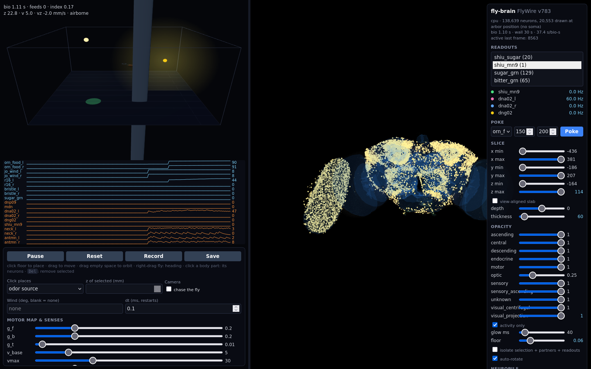

# fly-brain



Whole-brain spiking simulation of the adult *Drosophila* connectome (FlyWire v783: 138,639 neurons, 15.1 M weighted
connections) flying a fly through a 3D arena by smell, sight, airflow and touch, with a live 3D brain viewer that shows
activity moving through the brain as the fly acts. Model and parameters follow Shiu et al. 2024 (*Nature*), "A Drosophila computational
brain model reveals sensorimotor processing". Vocabulary is in `CONTEXT.md`.

## Run locally (CPU or CUDA)

```bash
scripts/fetch_data.sh                      # ~135 MB into data/
uv sync
uv run pytest                              # sugar GRNs -> MN9 fires; the 3D closed loop ticks, senses, collides, lands
uv run python -m flybrain.model            # headless trial, prints Readout rates and wall time
uv run uvicorn flybrain.server:app --port 8420   # arena + viewer at http://localhost:8420
uv run python scripts/dn_screen.py                # which descending neurons respond to left vs right odor
uv run python scripts/benchmark.py --episodes 10  # chemotaxis index, odor on vs off
REPLAY=trial.npz uv run uvicorn flybrain.server:app --port 8420   # scrub a recording, no GPU needed
```

## Arena (milestone 3: 3D flight)

The server hosts one shared World: a 100×100×50 mm box, a Fly with a body, odor sources, sugar patches, pillars and a
light. Every browser tab sees the same World and can change it. Each Tick (one 10 ms Frame) the loop runs brain →
motor readouts → Fly pose → what each body part senses → stimulus rates for the next Frame. Bio time runs at whatever
the GPU gives (~0.2x real time on a GTX 1080 in the dark; a light drives 7.9k photoreceptors and costs more).

| Body part | Senses (Population ← world) | Acts (Population → body) |
|---|---|---|
| antennae L/R | food ORNs (DM1, DM2, DM4, VA2) ← odor at the tip, `r0 + r_max·c/(c+k)`; JO wind neurons ← airspeed on that side | antennal motor neurons → flick |
| eyes L/R | R1-6 ← `ambient + r_light·cos(eye axis, light)` | |
| head bristles L/R | ← contact with a wall, pillar or ceiling on that side | |
| proboscis | sugar GRNs ← 150 Hz while landed on a patch | MN9 → extension; a Feed when above `mn9_thr` |
| legs | | DNp09 / MDN → `v = v_base + g_f·DNp09 − g_b·MDN` (walk when landed) |
| wings | | DNg02 → `vz = g_lift·DNg02 − sink`; DNa02 L−R → `ω = g_t·(L − R) + noise` |
| neck | | neck motor neurons → head yaw |

Every gain is a slider. Channel names are Population names, so the wire trailer, the channel strip under the arena and
the fly model's hover/click bindings all come from two lists in `flybrain/world.py`. See `docs/adr/0002` and
`docs/adr/0003` for why locomotion is decoded from descending neurons and which bindings are evidence-based.

- **Interact**: click the floor to place (odor source, sugar patch, pillar or light; shift-click = patch), drag to move,
  drag empty space to orbit, right-drag the fly to set heading, `z` input for the selected object, chase cam, Delete
  removes, wind and dt inputs, pause/reset, record/save. Hover a body part for its neurons' live rates; click it to make
  them the brain view's Readouts. Poke any Population or a single neuron at a rate for a duration.
- **Brain view**: shows what is active. Neurons grow and glow when they spike and fade in *biological* time (glow
  slider), so activity is watched at the simulation's pace and pausing freezes it; "activity only" (default) dims silent
  neurons to the floor slider. Sensory neurons have no soma and are drawn at their arbor position, so stimuli are seen
  arriving. Axis-aligned and view-aligned clip slabs, opacity per super class (optic lobes start at 25%), "isolate" keeps
  only the selected neuron, its partners and the Readouts. Click a neuron for type, side, transmitter, live rate and
  strongest partners; pin it for a spike trace. Neuropil hulls come from `flybrain/static/neuropils.glb`
  (`scripts/export_neuropils.py`, one-time export via fafbseg).

First result (raw weights, dt 0.1 ms): DNp09 and MDN never fire, only the left DNa02 does, and no descending neuron is
lateralized by odor side, so the default Motor Map does not produce chemotaxis. `scripts/benchmark.py` measures it;
`scripts/dn_screen.py` is where the next Motor Map comes from.

## Run on gpu1 (Docker)

Sync the tree from dev1 (data included, saves the download):

```bash
rsync -az --delete --exclude .venv --exclude .git -e "ssh -i ~/.ssh/homelab_ed25519" ./ millelog@gpu1.lan:apps/fly-brain/
ssh -i ~/.ssh/homelab_ed25519 millelog@gpu1.lan 'cd apps/fly-brain && docker compose up -d --build'   # http://gpu1.lan:8420
```

Measured, 1 s biological at dt 0.1 ms, sugar stimulus: GTX 1080 5.1 s wall, dev1 CPU (Ryzen 3600X) 7 s wall. The GPU is
kernel-launch bound at this activity level; raising dt or batching trials is the lever if it ever matters. Image is 14 GB
(CUDA wheels); container idles at ~1 GB RAM and 320 MB VRAM.

## How it works

- `flybrain/data.py` loads the connectome as CSR by presynaptic neuron and joins FlyWire annotations.
- `flybrain/model.py` is the LIF step loop. Synaptic input is gathered only for neurons that spiked (event-driven), so a
  step costs roughly proportional to activity, not to the 15 M edges. dt = 0.1 ms; ~7 s wall per biological second on a CPU.
- `flybrain/populations.py` names Populations (annotation queries or root-id lists) used as Stimuli and Readouts.
- `flybrain/world.py` is the Arena: one `tick()` per Frame applies queued commands, reads motor rates, flies the Fly,
  senses through its body parts and writes the next stimulus rates into the tensor the brain loop reads.
- `flybrain/server.py` runs one World on a thread and fans out Frames (10 ms windows of spike counts, plus a trailer of
  pose and sense/motor channels) over WebSockets to `static/index.html`: `arena.js` (three.js world and fly) and
  `brain.js` (three.js point cloud with a shader that sizes and colors neurons by activity).

Data sources: [eonsystemspbc/fly-brain](https://github.com/eonsystemspbc/fly-brain) (Shiu-format v783 weights),
[flyconnectome/flywire_annotations](https://github.com/flyconnectome/flywire_annotations) (cell types, soma positions).
